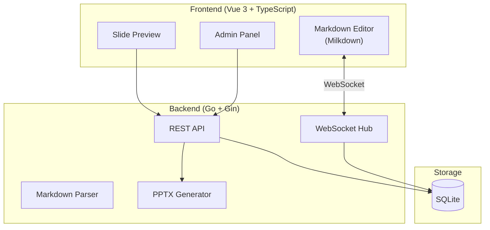

# Sheltie - Markdown 協同編輯投影片工具

線上協同編輯 Markdown 專案進展文件，自動轉換為投影片並匯出 PPTX。

## 技術架構



---

## Proposed Changes

### Backend (Go)

#### [NEW] [main.go](file:///Users/kywk/kywk/project/sheltie/backend/main.go)
- 應用程式入口，初始化 Gin router、WebSocket hub、資料庫連線

#### [NEW] [config/config.go](file:///Users/kywk/kywk/project/sheltie/backend/config/config.go)
- 環境變數配置（Admin 密碼、PORT、資料庫路徑）

#### [NEW] [database/](file:///Users/kywk/kywk/project/sheltie/backend/database/)
- `db.go` - SQLite 連線與初始化
- `models.go` - 資料模型定義

**SQLite Schema:**
```sql
CREATE TABLE workspaces (
    id TEXT PRIMARY KEY,           -- UUID
    name TEXT NOT NULL,
    description TEXT,
    content TEXT,                  -- Markdown 內容
    created_at DATETIME DEFAULT CURRENT_TIMESTAMP,
    updated_at DATETIME DEFAULT CURRENT_TIMESTAMP
);

CREATE TABLE workspace_versions (
    id INTEGER PRIMARY KEY AUTOINCREMENT,
    workspace_id TEXT NOT NULL,
    content TEXT,
    created_at DATETIME DEFAULT CURRENT_TIMESTAMP,
    FOREIGN KEY (workspace_id) REFERENCES workspaces(id)
);
```

#### [NEW] [handlers/](file:///Users/kywk/kywk/project/sheltie/backend/handlers/)
- `workspace.go` - 工作區 CRUD API
- `admin.go` - 管理員驗證 API
- `export.go` - PPTX 匯出 API
- `websocket.go` - WebSocket 連線處理

**REST API 設計:**

| Method | Endpoint | Description |
|--------|----------|-------------|
| GET | `/api/workspaces/:id` | 取得工作區內容 |
| PUT | `/api/workspaces/:id` | 更新工作區 (自動儲存) |
| POST | `/api/workspaces/:id/export` | 匯出 PPTX |
| GET | `/ws/:id` | WebSocket 協同編輯 |
| POST | `/api/admin/login` | 管理員登入 |
| GET | `/api/admin/workspaces` | 列出所有工作區 (需認證) |
| POST | `/api/admin/workspaces` | 新增工作區 (需認證) |
| PUT | `/api/admin/workspaces/:id` | 修改工作區名稱 (需認證) |
| DELETE | `/api/admin/workspaces/:id` | 刪除工作區 (需認證) |

#### [NEW] [websocket/](file:///Users/kywk/kywk/project/sheltie/backend/websocket/)
- `hub.go` - WebSocket 連線管理
- `client.go` - 客戶端連線處理

**WebSocket 同步機制:**
- 簡易同步：全文覆蓋模式
- 當用戶編輯時，將整份 Markdown 廣播給同房間所有用戶
- 每分鐘自動儲存到資料庫

#### [NEW] [parser/](file:///Users/kywk/kywk/project/sheltie/backend/parser/)
- `markdown.go` - Markdown 解析為專案結構

---

### Frontend (Vue 3)

#### [NEW] [package.json](file:///Users/kywk/kywk/project/sheltie/frontend/package.json)
**依賴套件:**
```json
{
  "dependencies": {
    "vue": "^3.5",
    "@milkdown/core": "^7.8",
    "@milkdown/preset-commonmark": "^7.8",
    "@milkdown/plugin-listener": "^7.8",
    "@milkdown/theme-nord": "^7.8",
    "pinia": "^2.2",
    "pptxgenjs": "^4.0",
    "vue-router": "^4.5"
  }
}
```

#### [NEW] [src/assets/main.css](file:///Users/kywk/kywk/project/sheltie/frontend/src/assets/main.css)
- 參考 border-collie 設計系統
- Glassmorphism 風格、深色/淺色主題
- CSS Variables 統一管理

#### [NEW] [src/components/](file:///Users/kywk/kywk/project/sheltie/frontend/src/components/)

| Component | Description |
|-----------|-------------|
| `SplitPane.vue` | 左右分割面板（編輯器/預覽） |
| `MarkdownEditor.vue` | Milkdown 編輯器整合 |
| `TextEditor.vue` | 純文字 Syntax Highlight 編輯器 |
| `SlidePreview.vue` | 投影片預覽元件 |
| `SlideRenderer.vue` | 單張投影片渲染 |
| `Navbar.vue` | 頂部導航列（分享、匯出按鈕） |
| `ShareDialog.vue` | 分享連結對話框 |
| `AdminPanel.vue` | 管理介面 |
| `LoginDialog.vue` | 管理員登入對話框 |

#### [NEW] [src/stores/](file:///Users/kywk/kywk/project/sheltie/frontend/src/stores/)
- `workspace.ts` - 工作區狀態管理
- `websocket.ts` - WebSocket 連線狀態

#### [NEW] [src/utils/](file:///Users/kywk/kywk/project/sheltie/frontend/src/utils/)
- `parser.ts` - Markdown 解析為投影片結構
- `pptx-export.ts` - PPTX 生成邏輯

**投影片規格實作:**

1. **排序邏輯:** 燈號 (紅>黃>綠) → 分類 → 上線日期
2. **彙整頁:** 每頁 10 專案，表格含燈號/名稱/狀態/進度/窗口
3. **專案頁:** 上 1/3 基本資訊表格，下 2/3 其他補充
4. **文字樣式:**
   - 預計項目：藍色斜體
   - 待追蹤項目：紅色粗體
   - 一個月前紀錄：灰色

---

### Deployment

#### [NEW] [docker-compose.yml](file:///Users/kywk/kywk/project/sheltie/docker-compose.yml)
```yaml
services:
  sheltie:
    build: .
    ports:
      - "8080:8080"
    volumes:
      - ./data:/app/data  # SQLite 持久化
    environment:
      - ADMIN_PASSWORD=changeme
      - PORT=8080
```

#### [NEW] [Dockerfile](file:///Users/kywk/kywk/project/sheltie/Dockerfile)
- Multi-stage build
- Stage 1: 使用 Node.js 編譯前端
- Stage 2: 使用 Go 編譯後端並嵌入前端 static files

---

## 專案目錄結構

```
sheltie/
├── backend/
│   ├── main.go
│   ├── go.mod
│   ├── config/
│   ├── database/
│   ├── handlers/
│   ├── websocket/
│   └── parser/
├── frontend/
│   ├── package.json
│   ├── vite.config.ts
│   ├── index.html
│   └── src/
│       ├── main.ts
│       ├── App.vue
│       ├── assets/
│       ├── components/
│       ├── stores/
│       ├── utils/
│       └── router/
├── docker-compose.yml
├── Dockerfile
└── README.md
```

---

## User Review Required

> [!IMPORTANT]
> **PPTX 生成方式選擇：**
> 後端 Go 可使用 [unioffice](https://github.com/unidoc/unioffice) 生成 PPTX，但該函式庫需要商業授權。
> 建議改用前端 `pptxgenjs` 直接在瀏覽器生成，與 border-collie 相同做法，免費且維護成本低。

> [!NOTE]
> **Milkdown 編輯器：** 已選用 Milkdown 作為 WYSIWYG 編輯器，支援 Vue 3 且可擴展。
> 若需要更穩定的選項，可改用 Tiptap。

---

## Verification Plan

### Automated Tests

1. **Go Backend Unit Tests**
```bash
cd backend
go test ./... -v
```
- 測試 Markdown parser
- 測試 workspace CRUD 邏輯
- 測試 WebSocket hub 連線管理

2. **Frontend Unit Tests**
```bash
cd frontend
npm run test
```
- 測試 Markdown to Slide parser
- 測試排序邏輯

### Manual Verification

1. **協同編輯測試**
   - 開啟兩個瀏覽器視窗連到同一工作區
   - 在一個視窗編輯，確認另一視窗即時更新

2. **投影片預覽測試**
   - 輸入範例 Markdown 格式
   - 確認投影片按規格排序與顯示

3. **PPTX 匯出測試**
   - 點擊匯出按鈕
   - 下載的 PPTX 用 PowerPoint/LibreOffice 開啟確認格式正確

4. **管理介面測試**
   - 訪問 `/admin` 路徑
   - 輸入密碼登入
   - 新增、修改、刪除工作區

5. **Docker 部署測試**
```bash
docker-compose up --build
# 訪問 http://localhost:8080
```
