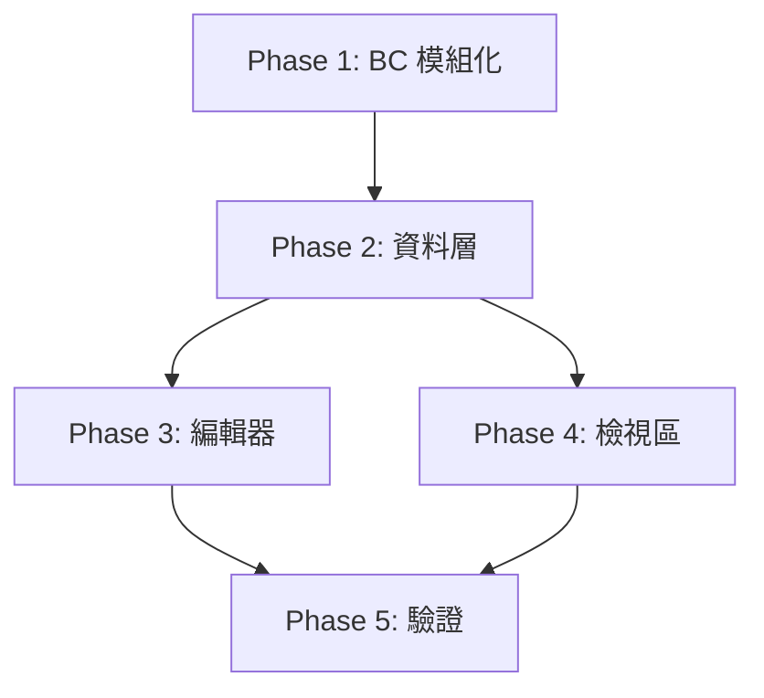

# Collie 整合實作計畫

將 BorderCollie 甘特圖功能整合至 Sheltie，讓 Sheltie 可引用 BorderCollie 的資料處理函式和 UI 組件來擴充甘特圖功能。**BorderCollie 保持獨立運作能力**。

## User Review Required

> [!IMPORTANT]
> **架構決策**：BorderCollie 組件將改為透過 props 接收資料，原有的 store 直接取資料邏輯將作為預設值（向下相容）。

> [!WARNING]
> **破壞性變更**：BorderCollie 內部目錄結構會調整（新增 `src/shared/`），但 submodule 外部介面不變。

---

## Proposed Changes

### Phase 1: BorderCollie 模組化重構

#### [NEW] [shared/](file:///Users/kywk/Dropbox/project/sheltie/border-collie/src/shared)
建立共用模組目錄結構：
```
border-collie/src/shared/
├── types/         # 型別定義
├── parser/        # 解析器
├── composables/   # 組合式函數
└── styles/        # 共用樣式變數
```

---

#### [MODIFY] [types/index.ts](file:///Users/kywk/Dropbox/project/sheltie/border-collie/src/types/index.ts)
- 移動至 `shared/types/index.ts`
- 原位置保留 re-export（向下相容）

---

#### [MODIFY] [parser/textParser.ts](file:///Users/kywk/Dropbox/project/sheltie/border-collie/src/parser/textParser.ts)
- 移動至 `shared/parser/textParser.ts`
- 原位置保留 re-export

---

#### [MODIFY] [ProjectGantt.vue](file:///Users/kywk/Dropbox/project/sheltie/border-collie/src/components/ProjectGantt.vue)
新增 props 支援外部傳入資料：

```typescript
// 新增 props 定義
const props = withDefaults(defineProps<{
  // 外部傳入資料 (Sheltie 使用)
  computedPhases?: ComputedPhase[]
  projects?: Project[]
  scale?: GanttScale
  barStyle?: 'block' | 'arrow'
  timeRange?: TimeRange
  // 控制項
  showHideControl?: boolean
  showZoomControl?: boolean
}>(), {
  showHideControl: true,
  showZoomControl: true
})

// 資料來源：優先使用 props，否則使用 store
const phases = computed(() => 
  props.computedPhases ?? store.computedPhases
)
```

---

#### [MODIFY] [PersonGantt.vue](file:///Users/kywk/Dropbox/project/sheltie/border-collie/src/components/PersonGantt.vue)
同 ProjectGantt 新增 props 支援。

---

#### [MODIFY] [useGanttScale.ts](file:///Users/kywk/Dropbox/project/sheltie/border-collie/src/composables/useGanttScale.ts)
- 移動至 `shared/composables/useGanttScale.ts`
- 修改為可傳入 timeRange 參數

---

#### [NEW] [shared/styles/variables.css](file:///Users/kywk/Dropbox/project/sheltie/border-collie/src/shared/styles/variables.css)
抽離共用 CSS 變數（顏色、主題、間距等）供 Sheltie 引用。

---

### Phase 2: Sheltie 資料層擴充

#### [MODIFY] [db.go](file:///Users/kywk/Dropbox/project/sheltie/backend/database/db.go)
擴充 workspaces 表：

```sql
ALTER TABLE workspaces ADD COLUMN collie_content TEXT DEFAULT '';
```

```go
type Workspace struct {
    // ... 現有欄位
    CollieContent string `json:"collieContent"` // 新增
}
```

---

#### [MODIFY] [workspace.go](file:///Users/kywk/Dropbox/project/sheltie/backend/handlers/workspace.go)
- `WorkspaceResponse` 新增 `CollieContent` 欄位
- `UpdateWorkspaceRequest` 新增 `CollieContent` 欄位

---

#### [MODIFY] [workspace.ts](file:///Users/kywk/Dropbox/project/sheltie/frontend/src/stores/workspace.ts)
- Store state 新增 `collieContent`
- WebSocket 訊息處理新增 collie 欄位同步

---

### Phase 3: Sheltie 編輯器整合

#### [NEW] [ColliEditor.vue](file:///Users/kywk/Dropbox/project/sheltie/frontend/src/components/ColliEditor.vue)
- 引用 BorderCollie 的 TextEditor 組件
- 支援 v-model 雙向綁定
- 整合 WebSocket 協同編輯

---

#### [MODIFY] [WorkspaceView.vue](file:///Users/kywk/Dropbox/project/sheltie/frontend/src/components/WorkspaceView.vue)
- 新增 Tab 切換：「專案進度」/「人力配置」
- 引入 ColliEditor

---

### Phase 4: Sheltie 檢視區整合

#### [NEW] [GanttView.vue](file:///Users/kywk/Dropbox/project/sheltie/frontend/src/components/GanttView.vue)
- 引用 BorderCollie 的 ProjectGantt / PersonGantt
- 透過 props 傳入從 API 取得的資料
- 實作專案時程優先邏輯：
  ```typescript
  // 若 collieContent 有相同專案 → 用 collie 時程
  // 若無 → 用 sheltie 的 phases
  ```

---

#### [MODIFY] [SlidePreview.vue](file:///Users/kywk/Dropbox/project/sheltie/frontend/src/components/SlidePreview.vue)
- 專案時程顯示優先使用 collie 資料

---

## Verification Plan

### Automated Tests

目前專案無自動化測試框架。建議後續加入，但本次以手動測試為主。

### Manual Verification

#### V1: BorderCollie 獨立運作驗證
```bash
cd border-collie
npm install
npm run dev
# 開啟 http://localhost:5173
```
- [ ] 確認甘特圖編輯功能正常
- [ ] 確認 LocalStorage 存取正常
- [ ] 確認 Gist 載入功能正常

#### V2: Sheltie 基本功能驗證
```bash
cd backend && go run main.go  # Terminal 1
cd frontend && npm run dev     # Terminal 2
# 開啟 http://localhost:5173
```
- [ ] 確認專案進度編輯正常
- [ ] 確認投影片預覽/播放正常
- [ ] 確認協同編輯正常（開兩個瀏覽器視窗）

#### V3: 整合功能驗證
- [ ] 確認「人力配置」Tab 可編輯
- [ ] 確認甘特圖檢視正常顯示
- [ ] 確認 collie_content 正確存入資料庫
- [ ] 確認時程優先邏輯（collie 優先）

---

## Implementation Order



**建議分批實作**：先完成 Phase 1 並驗證 BorderCollie 正常運作後，再進行後續整合。
