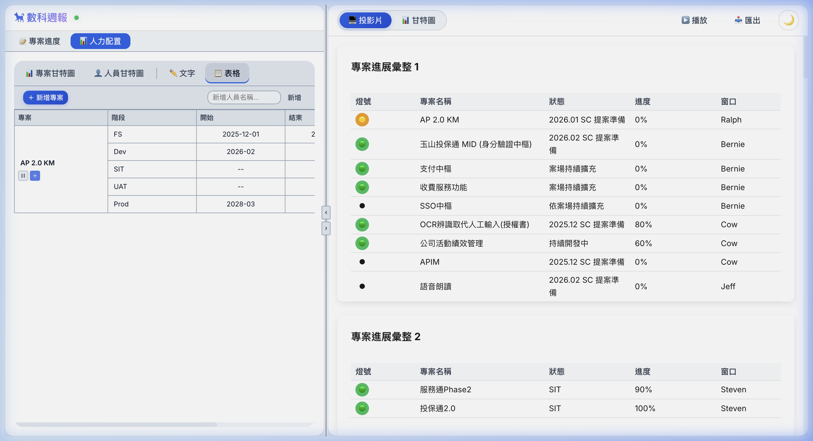
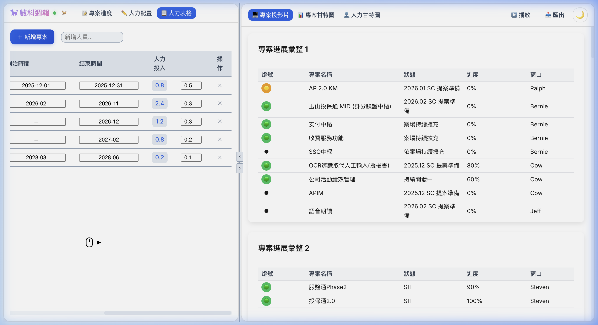
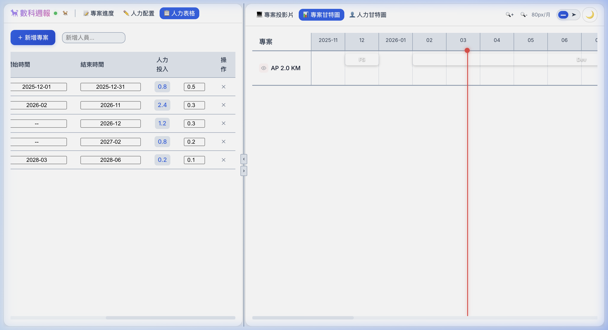
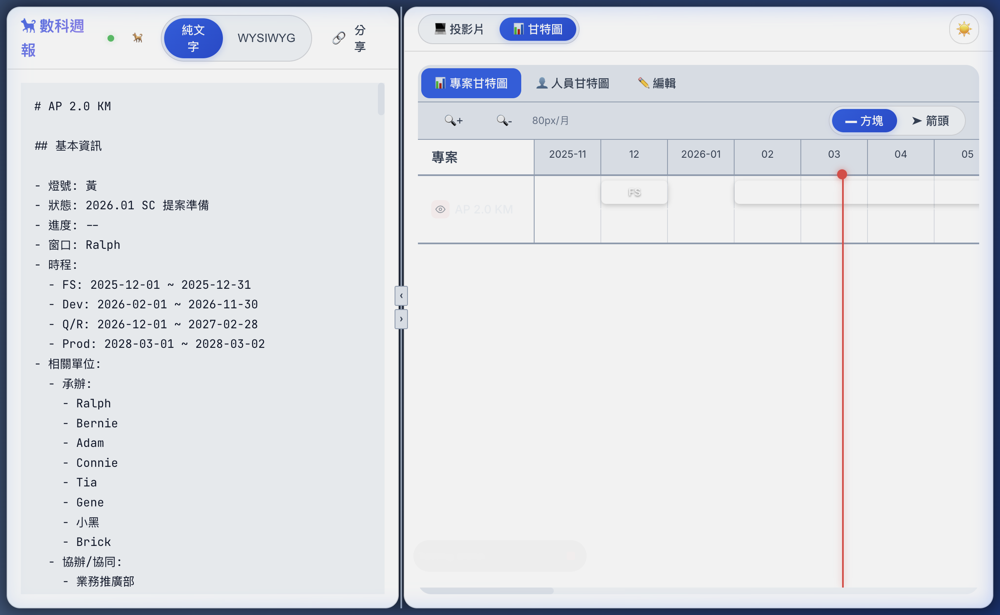
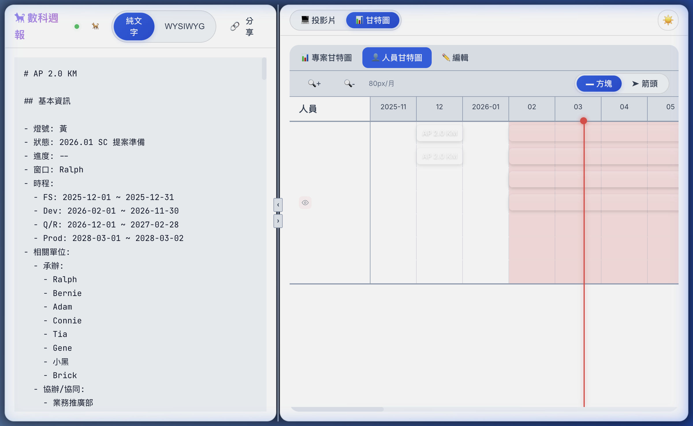

# Sheltie × Border-Collie 整合驗證

## 問題修復摘要

### Root Cause（根本原因）

`sheltie/frontend/src/components/ColliEditor.vue` 有兩個問題：

1. **錯誤的相對路徑**：import 路徑用的是 `../../border-collie/...`，但 `ColliEditor.vue` 在 `frontend/src/components/`，需要退三層才能到達 project root，應改為 `../../../border-collie/...`

2. **Vite alias 衝突**：`ProjectGantt.vue` 和 `PersonGantt.vue`（在 `border-collie/src/`）內部使用 `@/` alias，但 sheltie 的 `@` alias 指向 `frontend/src/`（而非 `border-collie/src/`）。所有 transitive import 也同樣受影響。

3. **真正的 Blocker**：`vite.config.js` 和 `vite.config.ts` 同時存在，但 Vite 載入 `.js` 版本，導致所有對 `.ts` 的修改都被忽略。

### 修改記錄

| 檔案 | 修改說明 |
|------|----------|
| `frontend/src/components/ColliEditor.vue` | `../../border-collie/...` → `../../../border-collie/...` |
| `frontend/vite.config.js` | 加入 `borderCollieAliasPlugin`：`transform` hook 將 border-collie 檔案裡的 `@/` import 預先改寫成絕對路徑 |

### Vite Plugin 技術說明

> Vite 6 的 `import-analysis` 插件在標準 `resolveId` hook 之前就處理了 `@/` 的 alias 替換，因此 `resolveId` 和 `customResolver` 方法都無效。改用 `transform` hook 在原始碼層面對 border-collie 文件進行預處理，此 hook 在 `import-analysis` 之前執行。

```js
function borderCollieAliasPlugin() {
    return {
        name: 'border-collie-alias',
        enforce: 'pre',
        transform(code, id) {
            if (!id.includes('/border-collie/src/')) return null;
            const rewritten = code.replace(/from\s+['"]@\//g, `from '${borderCollieRoot}/`);
            if (rewritten !== code) return { code: rewritten, map: null };
            return null;
        }
    };
}
```

### Validation Results

- ✅ **Gantt Chart Rendering**: Tested and successfully renders both `ProjectGantt` and `PersonGantt` based on parsed text from the workspace.
- ✅ **Remote Cursors**: Fixed rendering of remote cursors ensuring proper background coloration without breaking SVG elements inside user avatars.
-✅ **Single-Layer Tabs Redesign**: Refactored the UI to use a single row of tabs. Left panel edits (Text, Collie Text, Collie Table) and Right panel views (Slides, Project Gantt, Person Gantt).
- ✅ **Props-Based Border-Collie Components**: Refactored `TextEditor.vue` and `TableEditor.vue` within `border-collie` to act purely as props-driven components, extracting rendering logic to `WorkspaceView.vue`.
- ✅ **Stand-alone Border-Collie Functionality**: Added `*-WithStore` wrapper components to ensure `border-collie` standalone editor panel remains fully operable via `projectStore`.

#### Final Validated Screen Layout

**1. Split-Pane Workspace:**


**2. New Single-Layer Tab Design - Table Editor:**


**3. New Single-Layer Tab Design - Gantt Viewer:**

*AP 2.0 KM 專案正確顯示於時間軸，含 FS 階段 bar 和今日紅色標記*

---

## 驗證結果

### 📊 專案甘特圖 (Project Gantt)


*AP 2.0 KM 專案正確顯示於時間軸，含 FS 階段 bar 和今日紅色標記*

### 👤 人員甘特圖 (Person Gantt)


*人力配置 bars 正確顯示，超出 allocation 月份以紅底標示*

### ✅ 驗證清單

- [x] Workspace 頁面正常載入（無 Vite build error）
- [x] 左側 Markdown editor 顯示 workspace 內容
- [x] 右側「甘特圖」按鈕切換至 ColliEditor
- [x] 📊 專案甘特圖 — 正確渲染 AP 2.0 KM 各 phase bar
- [x] 👤 人員甘特圖 — 正確渲染人員 allocation（Ralph, Amy, Ben, Carol 等）
- [x] ✏️ 編輯 tab — 顯示正確的 Gantt 原始文字資料
- [x] 瀏覽器 Console — 無錯誤（只有 `WebSocket connected`）
- [x] `collieContent` 資料能從 backend API 載入並傳給 ColliEditor
