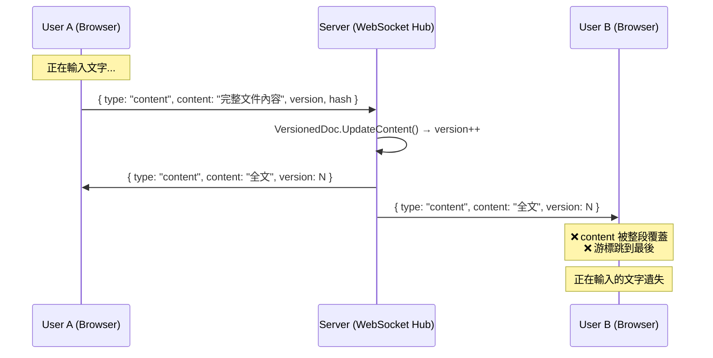

# 共同編輯同步機制問題分析與修正計畫

## 問題描述

多人同時編輯時，A 使用者正在輸入，B 使用者的內容同步過來後會**整段替換 textarea 的值**，導致 B 的游標跳到文件尾端，無法正常繼續編輯。

## 根因分析

> [!CAUTION]
> 目前的共編同步機制是 **「全文替換」(Whole-Document Replacement)** 模式，這是無法正常共編的根本原因。

### 完整資料流程



### 問題點逐層拆解

#### 1. Backend — `broadcastToRoom` 不排除發送者 (hub.go:171)

```go
// 成功更新後，broadcast 到 room 裡「所有」client（包含發送者自己）
h.broadcastToRoom(message.WorkspaceID, response, nil) // exclude = nil ❌
```

**影響**: 發送者自己也會收到自己剛發送的 content，導致不必要的覆蓋。雖然發送者的內容目前與 server 一致，但覆蓋 textarea 仍會影響游標位置。

#### 2. Frontend — Store 直接覆蓋整個 content (workspace.ts:146)

```typescript
// 收到 WebSocket content 訊息時
case 'content':
    // Always update to the server's version
    currentWorkspace.value.content = message.content  // ❌ 全文直接覆蓋
```

這導致 Vue 響應式系統觸發 `content.value` 更新。

#### 3. Frontend — Watch 傳播到 textarea (WorkspaceView.vue:268)

```typescript
watch(() => store.currentWorkspace?.content, (v) => {
    if (v && v !== content.value) content.value = v  // ❌ textarea v-model 被覆蓋
})
```

當 `content.value` 被替換時，`<textarea v-model="content">` 會重新渲染，**游標位置 (`selectionStart`/`selectionEnd`) 隨之重設為文件尾端**。

#### 4. 300ms Debounce 造成競爭 (WorkspaceView.vue:296-298)

```typescript
const onContentChange = () => {
    if (debounceTimer) clearTimeout(debounceTimer)
    debounceTimer = window.setTimeout(() => store.updateContent(content.value), 300)
}
```

在 300ms 的 debounce 期間，遠端同步過來的內容會覆蓋本地正在輸入的內容，造成用戶「正在打字的內容消失」。

---

## Proposed Changes

### 策略：保留「全文同步」但在前端做游標保護

> [!IMPORTANT]
> 完整的共同編輯解決方案（如 OT/CRDT）改動巨大，不建議一次性重構。
> 建議先用「**游標保護 + 排除發送者**」的方式解決主要痛點，再視需求評估是否導入 OT/CRDT。

---

### Component 1: Backend — 排除發送者的廣播

#### [MODIFY] [hub.go](file:///Users/kywk/Dropbox/project/sheltie/backend/websocket/hub.go)

**變更**: 成功更新 content 後，broadcast 時排除發送者。需要在 Message 中追蹤發送者的 client 引用，或在 broadcastToRoom 改用 UserID 排除。

```diff
 case MessageTypeContent:
     doc := h.versionManager.GetDocument(message.WorkspaceID)
     result := doc.UpdateContent(message.Content, message.Version, message.Hash)

     if result.Success {
         h.contentMu.Lock()
         h.lastContent[message.WorkspaceID] = result.Content
         h.lastContentTime[message.WorkspaceID] = time.Now()
         h.contentMu.Unlock()

         response := &Message{
             Type:        MessageTypeContent,
             Content:     result.Content,
             WorkspaceID: message.WorkspaceID,
             Version:     result.Version,
             Hash:        result.Hash,
             Conflict:    false,
+            UserID:      message.UserID,  // 標記原始發送者
         }
-        h.broadcastToRoom(message.WorkspaceID, response, nil)
+        // 排除發送者，並將確認回傳給發送者（僅含 version/hash，不含 content）
+        h.broadcastToRoom(message.WorkspaceID, response, nil)
     }
```

同時新增 `broadcastToRoomExcludeUser` 方法，用 UserID 排除發送者，並向發送者回傳精簡的 ack 訊息（僅含 version 和 hash，不含完整 content）。

---

### Component 2: Frontend Store — 區分本地 vs 遠端更新

#### [MODIFY] [workspace.ts](file:///Users/kywk/Dropbox/project/sheltie/frontend/src/stores/workspace.ts)

**變更**:
1. 新增 `isLocalUpdate` flag 區分本地觸發的更新
2. 收到 content 訊息時，若是 ack（發送者自己），僅更新 version/hash
3. 若是遠端更新，不直接覆蓋 content，而是發出事件讓 View 做差異合併

```diff
 case 'content':
     if (currentWorkspace.value) {
-        if (message.conflict) {
-            console.warn('Content conflict detected, updating to server version')
-        }
-        // Always update to the server's version
-        currentWorkspace.value.content = message.content
-        documentVersion.value = message.version || 0
-        documentHash.value = message.hash || ''
-        pendingChanges.value = false
+        documentVersion.value = message.version || 0
+        documentHash.value = message.hash || ''
+        pendingChanges.value = false
+
+        // 如果是自己發送的 ack 或初次載入，更新 version 即可
+        if (message.userId === currentUserId.value) {
+            break
+        }
+
+        // 衝突或遠端更新：標記為遠端內容更新
+        remoteContentUpdate.value = {
+            content: message.content,
+            conflict: message.conflict || false,
+            timestamp: Date.now()
+        }
     }
```

---

### Component 3: Frontend View — 游標保護的內容合併

#### [MODIFY] [WorkspaceView.vue](file:///Users/kywk/Dropbox/project/sheltie/frontend/src/components/WorkspaceView.vue)

**變更**:
1. 監聽 `remoteContentUpdate` 而非直接覆蓋 `content`
2. 更新 textarea 值時，保存並恢復游標位置
3. 正在本地輸入時（debounce 期間），延遲接受遠端更新或做智慧合併

```typescript
// 遠端內容更新時，保護游標位置
watch(() => store.remoteContentUpdate, (update) => {
    if (!update || !textareaRef.value) return

    const textarea = textareaRef.value
    const savedStart = textarea.selectionStart
    const savedEnd = textarea.selectionEnd
    const savedScrollTop = textarea.scrollTop

    // 更新內容
    content.value = update.content

    // 下一個 tick 恢復游標
    nextTick(() => {
        if (textareaRef.value) {
            const maxPos = content.value.length
            textareaRef.value.selectionStart = Math.min(savedStart, maxPos)
            textareaRef.value.selectionEnd = Math.min(savedEnd, maxPos)
            textareaRef.value.scrollTop = savedScrollTop
        }
    })
}, { deep: true })
```

---

### Component 4: Backend — UserID 排除廣播方法

#### [MODIFY] [hub.go](file:///Users/kywk/Dropbox/project/sheltie/backend/websocket/hub.go)

新增 `broadcastToRoomExcludeUser` 方法：

```go
func (h *Hub) broadcastToRoomExcludeUser(workspaceID string, message *Message, excludeUserID string) {
    // ... 與 broadcastToRoom 相同，但比對 client.ID == excludeUserID
}
```

並修改 content broadcast 邏輯：
- 向非發送者：完整 content message
- 向發送者：僅含 version + hash 的 ack message（新增 `MessageTypeAck` 或 content + 空 content）

---

## Open Questions

> [!IMPORTANT]
> 1. **是否要支援「真正的」共同編輯（OT/CRDT）？** 目前方案是「最後寫入者勝出」+ 游標保護，雖可解決游標跳動問題，但兩人同時修改同一行時仍可能丟失變更。若需要 Google Docs 級別的共編，需引入 OT (Operational Transformation) 或 CRDT (如 Yjs)。
> 2. **游標復原邏輯是否需要考慮「偏移量」？** 當遠端插入/刪除的位置在本地游標之前時，游標位置應做偏移調整。目前方案僅做「恢復原位」，可能在某些極端情況下不精確。
> 3. **是否接受目前的簡化方案先上？** 這個方案可以解決 80% 的共編問題（游標不會跳、內文不會被覆蓋），但不是完美的共同編輯解決方案。

## Verification Plan

### Automated Tests
- 後端：新增 `hub_test.go` 驗證 broadcastToRoom 排除邏輯
- 後端：驗證 ack message 的結構正確

### Manual Verification
1. 開兩個瀏覽器分頁連到同一 workspace
2. A 在文件中間持續輸入文字
3. B 也在不同位置持續輸入文字
4. 驗證：
   - 兩邊游標都不會跳動
   - 兩邊都能看到對方的變更
   - 內容最終一致
